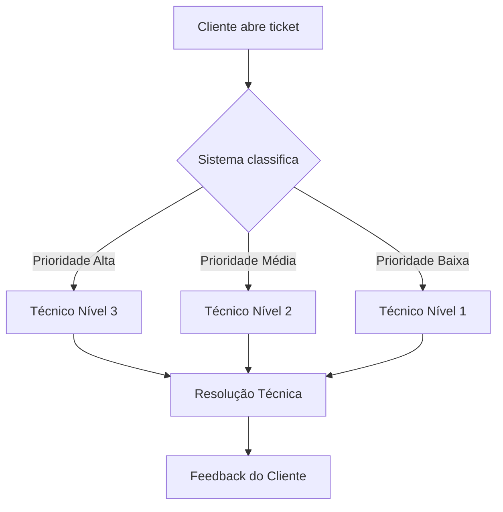

# 🔧 Sistema de Helpdesk 

Bem-vindo ao **Sistema de Helpdesk** - uma solução escalável para gestão de chamados técnicos, construída com arquitetura de microsserviços e pronta para ambientes cloud!

## 🚀 Visão Geral
Uma central de atendimento digital onde:
- **Clientes** reportam problemas técnicos
- **Equipes de TI** gerenciam solicitações
- **SLA automatizado** prioriza demandas críticas
- **Múltiplos níveis** de suporte técnico

---

## 🏗️ Arquitetura do Sistema

**Componentes Principais:**
- **API Gateway**: Roteamento de requisições (Spring Cloud Gateway)
- **Discovery Service**: Registro de microsserviços (Eureka)
- **Ticket Service**: Gestão de chamados (Prioridades, Categorização)
- **User Service**: Autenticação e gestão de usuários
- **RabbitMQ**: Comunicação assíncrona entre serviços
- **PostgreSQL**: Armazenamento de dados transacionais

---

## ⚙️ Funcionalidades Detalhadas

### 🎯 Núcleo do Sistema
| Funcionalidade          | Descrição                                                                 |
|-------------------------|---------------------------------------------------------------------------|
| Triagem Automática      | Classificação por IA baseada em histórico                                 |
| Escalonamento Inteligente | Priorização dinâmica (Ex: "Crítica" para falhas em produção)             |
| Notificações Multi-canal | Email, Slack e Webhooks para atualizações                                |

### 🔄 Fluxo de Atendimento (Exemplo)

## 🛠️ Stack Tecnológica

### **Backend**
- **Spring Boot** - Framework principal para desenvolvimento de microsserviços
- **Spring Cloud** - Configuração distribuída e service discovery
- **OpenFeign** - Comunicação entre microsserviços
- **Hibernate Validator** - Validação de dados nas APIs
- **Lombok** - Redução de boilerplate code

### **Banco de Dados**
- **PostgreSQL** - Armazenamento transacional de tickets e usuários

### **Infraestrutura**
- **Docker** - Conteinerização dos serviços
- **Docker Compose** - Orquestração do ambiente local
- **RabbitMQ** - Sistema de mensageria para eventos assíncronos
- **Eureka Server** - Service registry para microsserviços

### **Monitoramento**
- **Spring Boot Actuator** - Métricas de saúde dos serviços
- **Prometheus** - Coleta de métricas de desempenho
- **Grafana** - Dashboard para visualização de dados

### **Testes**
- **JUnit 5** - Framework de testes unitários

## 🤝 Contribuição

1. Clone o projeto
2. Cria a branch da sua feature (`git checkout -b feature/AmazingFeature`)
3. Faça o commit das suas mudanças (`git commit -m 'Add some AmazingFeature'`)
4. Realize o push para branch (`git push origin feature/AmazingFeature`)
5. Abra um pull request
